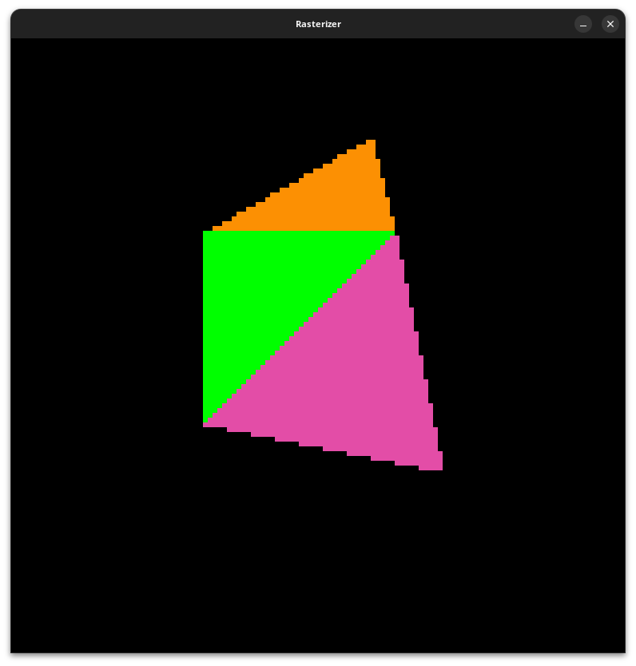

# 🖼️ CPU Software Rasterizer

A CPU-based software rasterizer written in C **from scratch** to explore the fundamentals of the graphics pipeline and low-level rendering.

## ✨ Features (In Progress)

* Triangle rasterization ✅
* Depth buffering (Z-buffer) ⬜
* Backface culling ⬜
* Perspective-correct interpolation ⬜
* Texture mapping ⬜
* Basic lighting (Lambert/Phong) ⬜
* Performance optimizations (SIMD/multithreading) ⬜

## ⚙️ Prerequisites

### 🐧 Linux / 🍎 macOS

* C compiler ([GCC](https://gcc.gnu.org/) or [Clang](https://clang.llvm.org/))
* [SDL2](https://www.libsdl.org/) development libraries
* [pkg-config](https://www.freedesktop.org/wiki/Software/pkg-config/) (used for automatic SDL2 detection)

### 🪟 Windows

* C compiler ([GCC](https://gcc.gnu.org/) or [Clang](https://clang.llvm.org/))

> Linux/macOS builds use system-installed SDL2 via pkg-config.
> Windows uses the bundled SDL2, no additional installation required.

## 🛠️ Build, Run & Clean

### 🐧 Linux / 🍎 macOS

```bash
make
make run
make clean
```

> Uses GCC by default. To use Clang:
>
> ```bash
> make CC=clang
> ```

### 🪟 Windows

```bash
make build-win
make run-win
make clean-win
```

## 📸 Preview


