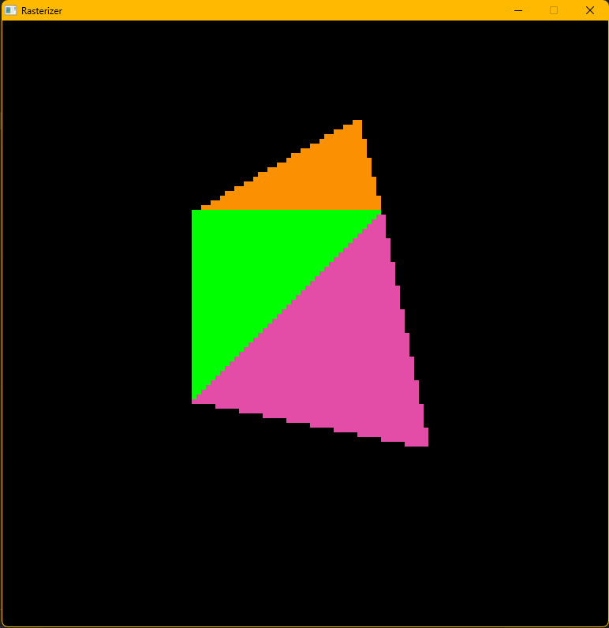

# CPU Software Rasterizer

A CPU-based software rasterizer written in C **from scratch** to explore the fundamentals of the graphics pipeline and low-level rendering.

## Features (In Progress)
- Triangle rasterization ✅
- Depth buffering (Z-buffer) ⬜
- Backface culling ⬜
- Perspective-correct interpolation ⬜
- Texture mapping ⬜
- Basic lighting (Lambert/Phong) ⬜
- Performance optimizations (SIMD/multithreading) ⬜

## Build, Run & Clean 
### For Linux / macOS
```bash
make
make run
make clean
```
### For Windows
```bash
make build-win
make run-win
make clean-win
```

## Demo / Screenshot

